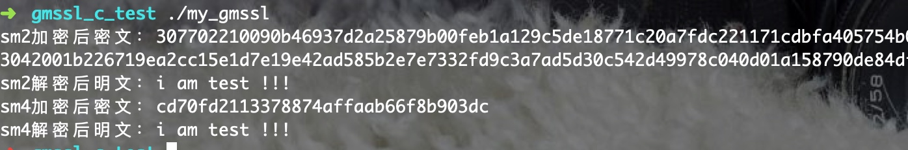

# 关于国密开源库（GmSSL）在Linux、python、Android、java、ios中的应用

## 什么是国密？
国密即国家密码局认定的国产密码算法。主要有SM1，SM2，SM3，SM4和最新的sm9。在国内环境主要使用的国家密码局认定的算法。

SM2算法：SM2椭圆曲线公钥密码算法是我国自主设计的公钥密码算法，包括SM2-1椭圆曲线数字签名算法，SM2-2椭圆曲线密钥交换协议，SM2-3椭圆曲线公钥加密算法，分别用于实现数字签名密钥协商和数据加密等功能。SM2算法与RSA算法不同的是，SM2算法是基于椭圆曲线上点群离散对数难题，相对于RSA算法，256位的SM2密码强度已经比2048位的RSA密码强度要高。

**其实就是类似RSA算法，但是大家都知道，RSA算法位数要求已经在2048以上了，SM2不同的是可以使用较少的位数保证较强的密码强度。**

SM3算法，SM3杂凑算法是我国自主设计的密码杂凑算法，适用于商用密码应用中的数字签名和验证消息认证码的生成与验证以及随机数的生成，可满足多种密码应用的安全需求。为了保证杂凑算法的安全性，其产生的杂凑值的长度不应太短，例如MD5输出128比特杂凑值，输出长度太短，影响其安全性SHA-1算法的输出长度为160比特，SM3算法的输出长度为256比特，因此SM3算法的安全性要高于MD5算法和SHA-1算法。

**与md5相似，但是比md5更长，具有更高的安全性。**

SM4算法：分组密码算法是我国自主设计的分组对称密码算法，用于实现数据的加密/解密运算，以保证数据和信息的机密性。要保证一个对称密码算法的安全性的基本条件是其具备足够的密钥长度，SM4算法与AES算法具有相同的密钥长度分组长度128比特，因此在安全性上高于3DES算法。

**与AES相似。**

SM9算法：是由国密局发布的一种IBE(Identity-Based Encryption)算法。IBE算法以用户的身份标识作为公钥，不依赖于数字证书。

**一种新型的公私钥算法，基于身份标识的。**

## openssl的编程初探
在算法实现中，不免要使用openssl库来进行操作，openssl 很强大，提供了健壮的，全功能的加密套件。

[openssl官网](https://www.openssl.org/)

有兴趣的同学可以详细去学习下，openssl有着大量的API可以使用，可以实现大量的密码算法。
## 开源算法（gmsll.org）
这里我使用的是北京大学[关志](https://github.com/guanzhi)副研究员的密码学研究组开发维护的[GmSSL](http://gmssl.org/),此项目上openssl的分支，可以替代openssl，并增加了对国密的支持.

在网上找了很多关于此开源库的使用方法，都不是很明白，我对这个项目的使用方法做一个总结，可以支持在多个平台上使用。

## 下面我们来看看具体的使用方法
示例代码可以在[github]()上面可以下载得到，给出了测试代码，可以直接进行下载调试，主要实现的是**sm2的加解密**，**sm4的加解密**，欢迎star。
使用方法都是：
1. 编译GmSSL库，得到对应的文件。
2. 引用文件。
3. 使用对应语言调用。

编译环境为（macbook + ubuntu虚拟机）
### evp api
#### 介绍
首先是 **EVP API**，这是对GmSSL接口的一个封装，隐藏了API实现的细节，提供了一个抽象的，统一的接口。我们可以借助这个接口来实现其他平台的使用。
#### 编译
我在Ubuntu环境下面
`./config`
`make`
make成功后，生成 libcrypto.so.1.1 和 libssl.so.1.1
在code文件夹下面，编写自己的sm4.c,utils.c,sm2.c
然后利用下面的代码进行编译。
`gcc -Wall code/sm4.c code/sm2.c code/utils.c -o my_gmssl -lssl -lcrypto -L. -I include -I apps -I . -L /usr/lib/ssl`
#### 测试
编写测试代码：


运行结果：

测试成功。

### java API的使用方法（Android）
#### 介绍
在Android里面调用这个库的方法，主要是通过编译.so动态链接库的方式进行引用。在官方的[github](https://github.com/guanzhi/GmSSL/blob/master/java/)中，已经给出了相关代码，但是缺少了ndk编译过程。
#### 编译
#### 坑
有些手机里面并不支持，.so.1.1的soname，所以在引用libssl.so.1.1 和libcrypto.so.1.1的时候出现了问题，解决方法是
```
readelf -d libssl.so.1.1
```
### python 调用方法
#### 坑
当使用memcpy或者strcpy进行复制结果字符串时，在c语言里面运行正常，但是引入到python里面的时候会出现多一位或几位字符的情况，所以输出结果转换成了16进制字符串，这样结果就稳定了。
### ios使用方法

### nodejs使用方法
#### 坑
c++ 编译bug，sm2 bug
## 小结
